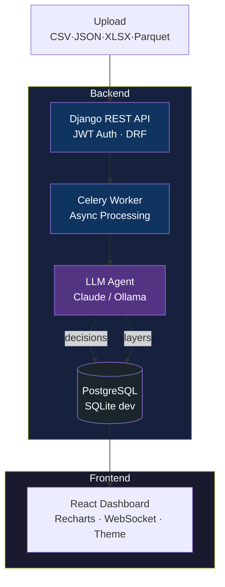
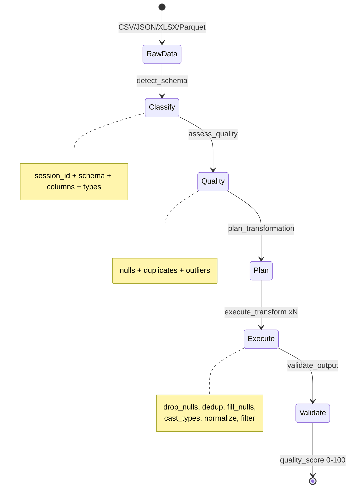
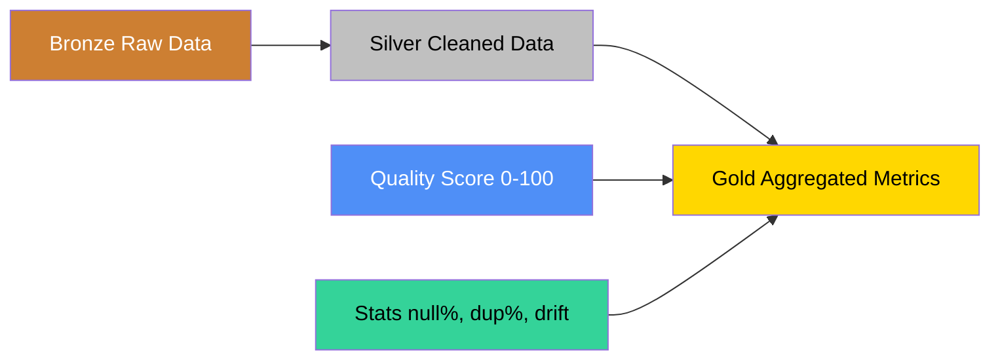

<div align="center">

# ⚡ DataFlow Agent

**Pipeline orquestrador onde agentes LLM decidem autonomamente como processar, limpar e carregar dados.**

[](https://python.org)
[](https://djangoproject.com)
[](https://react.dev)
[](https://ollama.com)
[](LICENSE)

[Sobre](#-sobre) • [Arquitetura](#-arquitetura) • [Quick Start](#-quick-start) • [API Reference](#-api-reference) • [Roadmap](#-roadmap)

</div>

---

## 📌 Sobre

O **DataFlow Agent** é um sistema inteligente de processamento de dados que utiliza LLMs com **tool use** para criar um agente autônomo capaz de:

- **Classificar** automaticamente o schema de qualquer dataset (CSV, JSON, Excel, Parquet)
- **Analisar** a qualidade dos dados (nulos, duplicatas, outliers, tipos inconsistentes)
- **Planejar** transformações com base nos problemas encontrados
- **Executar** o plano de limpeza e transformação de forma autônoma
- **Validar** o resultado final com score de qualidade 0–100

Cada decisão do agente é registrada com seu raciocínio completo, criando um **log auditável** de todo o processo — do dado bruto ao dado limpo em camadas bronze/silver/gold.

Suporta **Claude API** (Anthropic) e **Ollama local** (qualquer modelo com tool use, ex: qwen3.5) como backend do agente.

---

## 🏗 Arquitetura



### Fluxo do Agente (Agentic Loop)



### Camadas de Dados



---

## 🚀 Quick Start

### Pré-requisitos

- Python 3.11+
- Redis (para Celery)
- Node.js 18+ (frontend)
- Claude API key **ou** [Ollama](https://ollama.com) rodando localmente

### 1. Clone e configure o ambiente

```bash
git clone https://github.com/pizanao/dataflow-agent.git
cd dataflow-agent

python -m venv .venv && source .venv/bin/activate
pip install -r backend/requirements.txt

cd frontend && npm install && cd ..
```

### 2. Configure o `.env`

```bash
cp .env.example .env
```

```env
SECRET_KEY=sua-secret-key-aqui
DATABASE_URL=sqlite:////caminho/absoluto/para/backend/db.sqlite3

# Opção A — Claude API (pago)
ANTHROPIC_API_KEY=sk-ant-sua-chave-aqui

# Opção B — Ollama local (gratuito)
AGENT_MOCK=true
OLLAMA_URL=http://localhost:11434
OLLAMA_MODEL=qwen2.5:3b
```

### 3. Inicialize o banco e crie o usuário

```bash
cd backend
python manage.py migrate
python manage.py createsuperuser --username admin --email ""
```

### 4. Suba tudo com um comando

```bash
# Na raiz do projeto
./run_dev.sh
```

O script sobe **daphne** (ASGI + WebSocket), **Celery worker** e **Vite** em paralelo, com cleanup automático no Ctrl+C.

### 5. Acesse

| Serviço       | URL                          |
|---------------|------------------------------|
| Dashboard     | http://localhost:5173        |
| API (DRF)     | http://localhost:8000/api/   |
| Admin Django  | http://localhost:8000/admin/ |
| Health Check | http://localhost:8000/api/health/ |

### 6. Primeiro pipeline

1. Faça login no dashboard com o usuário criado
2. Crie um novo pipeline
3. Faça upload do `demo_data.csv` (incluso na raiz do projeto)
4. Acompanhe o agente processar em tempo real via WebSocket

---

## ⚙ Como Funciona

### Stack Técnica

| Camada          | Tecnologia                     | Função                                       |
|-----------------|-------------------------------|----------------------------------------------|
| **Backend**     | Django 5.1 + DRF 3.15         | API REST, JWT auth, ORM                      |
| **Auth**        | djangorestframework-simplejwt  | JWT, tokens de 8h + refresh 7 dias           |
| **Async**       | Celery 5.4 + Redis             | Processamento assíncrono com retry           |
| **Database**    | SQLite (dev) / PostgreSQL (prod) | Persistência + camadas bronze/silver/gold  |
| **Agente IA**   | Claude API ou Ollama (tool use) | Decisões autônomas de transformação         |
| **Analytics**   | DuckDB 1.1                     | Queries analíticas in-memory com window fns |
| **Real-time**   | Django Channels 4 + Redis      | WebSocket para status de runs               |
| **Frontend**    | React 18 + Recharts + Vite     | Dashboard com charts, timeline, gauge       |

### Endpoints da API

Todos os endpoints requerem autenticação JWT (`Authorization: Bearer <token>`).

**Auth**

| Método | Endpoint                  | Descrição              |
|--------|---------------------------|------------------------|
| POST   | `/api/auth/token/`        | Obter token de acesso  |
| POST   | `/api/auth/token/refresh/`| Renovar token          |

**Health**

| Método | Endpoint     | Descrição                    |
|--------|-------------|------------------------------|
| GET    | `/api/health/`| Status do Ollama e sistema |

**Pipelines**

| Método | Endpoint                          | Descrição                            |
|--------|-----------------------------------|--------------------------------------|
| GET    | `/api/pipelines/`                 | Listar (filtros: `search`, `status`) |
| POST   | `/api/pipelines/`                 | Criar pipeline                       |
| GET    | `/api/pipelines/{id}/`            | Detalhe com sources e recent_runs    |
| PATCH  | `/api/pipelines/{id}/`            | Atualizar                            |
| DELETE | `/api/pipelines/{id}/`            | Remover                              |
| POST   | `/api/pipelines/{id}/upload/`     | Upload CSV/JSON/Excel/Parquet        |
| POST   | `/api/pipelines/{id}/trigger/`    | Disparo manual                       |
| GET    | `/api/pipelines/{id}/stats/`      | Métricas agregadas                   |
| GET    | `/api/pipelines/{id}/analytics/`  | DuckDB analytics (charts)            |

**Runs**

| Método | Endpoint                       | Descrição                                    |
|--------|--------------------------------|----------------------------------------------|
| GET    | `/api/runs/`                   | Listar (filtros: `pipeline`, `status`, `page`) |
| GET    | `/api/runs/{id}/`              | Detalhe + decisions + quality report + layers |
| GET    | `/api/runs/{id}/export/`       | Download dos dados (`?format=csv|parquet`)  |

**WebSocket**

```
ws://localhost:8000/ws/pipelines/{id}/
```

Recebe atualizações de status em tempo real enquanto o agente processa.

### Estrutura do Projeto

```
dataflow-agent/
├── backend/
│   ├── config/
│   │   ├── settings.py        # Settings + JWT + DuckDB + Channels
│   │   ├── asgi.py            # ProtocolTypeRouter HTTP + WebSocket
│   │   ├── celery.py
│   │   └── urls.py
│   ├── dataflow/
│   │   ├── models.py          # Pipeline, DataSource, ProcessingRun,
│   │   │                      # AgentDecision, QualityReport, DataLayer
│   │   ├── agent/
│   │   │   ├── engine.py      # Agentic loop (Claude API + Ollama)
│   │   │   └── tools.py       # 5 tools com handlers pandas reais
│   │   ├── analytics/
│   │   │   ├── engine.py      # DuckDB: quality trend, step stats,
│   │   │   │                  # retention, cost trend
│   │   │   └── costs.py       # Custo USD (blended rate)
│   │   ├── api/
│   │   │   ├── views.py       # ViewSets + actions + filtros
│   │   │   └── serializers.py
│   │   ├── processing/
│   │   │   └── tasks.py       # Celery task + bronze/silver/gold
│   │   ├── consumers.py       # WebSocket consumer
│   │   └── routing.py
│   ├── tests/
│   │   ├── agent/             # Testes unitários dos tool handlers
│   │   └── api/               # Testes de integração (JWT, CRUD,
│   │                          # filtros, runs, decisions)
│   └── requirements.txt
├── frontend/
│   └── src/
│       ├── App.jsx            # Dashboard completo
│       │                      # LoginScreen, PipelineList, PipelineDetail,
│       │                      # RunDetail, QualityGauge, RunTimeline,
│       │                      # AnalyticsSection, dark/light theme
│       ├── hooks/useApi.js    # Fetch + JWT headers + auto-logout 401
│       └── utils/formatters.js
├── demo_data.csv              # Dataset RH para testes
├── run_dev.sh                 # Sobe daphne + celery + vite
├── docker-compose.yml
└── .env.example
```

---

## 🧪 Testes

```bash
cd backend
source ../.venv/bin/activate

# Todos os testes
pytest

# Testes do agente
pytest tests/agent/ -v

# Testes de API
pytest tests/api/ -v
```

---

## 🗺 Roadmap

- [x] Agentic loop com Claude API tool use
- [x] Suporte a Ollama local (qwen, llama, etc.)
- [x] 5 tools com handlers pandas reais
- [x] API REST com DRF + JWT auth
- [x] Upload CSV / JSON / Excel / Parquet
- [x] Export CSV / Parquet dos dados processados
- [x] Celery tasks com retry e broadcast WebSocket
- [x] Camadas bronze / silver / gold
- [x] DuckDB analytics (quality trend, cost trend, retention)
- [x] Dashboard React com dark/light theme
- [x] QualityGauge circular, RunTimeline, MetricCards
- [x] Filtros e paginação na API e no frontend
- [x] Testes automatizados (pytest + factory_boy)
- [x] Health check `/api/health/` com status Ollama
- [x] Indicador visual de status no frontend
- [ ] Celery Beat — agendamento via cron UI
- [ ] Webhook notifications (Slack, Discord)
- [ ] Docker Compose completo para produção

---

## 📄 Licença

Este projeto está sob a licença MIT. Veja o arquivo [LICENSE](LICENSE) para mais detalhes.

---

<div align="center">

Desenvolvido por **Daniel Pizani** · 2026

Django · Celery · Claude API · Ollama · React · DuckDB · PostgreSQL

</div>